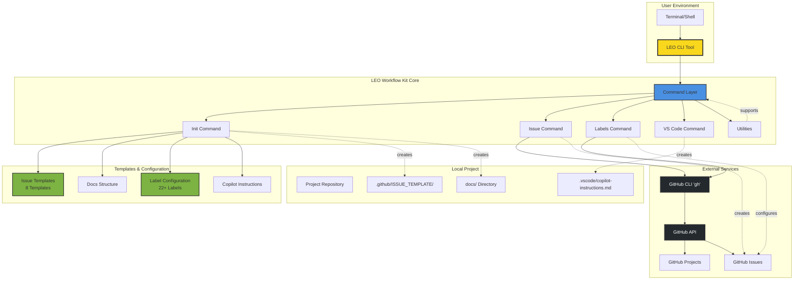

<div align="center">

# 🦁 LEO Workflow Kit

### **Complete GitHub Workflow Automation Toolkit**

[](https://www.npmjs.com/package/leo-workflow-kit)
[](https://opensource.org/licenses/MIT)
[](https://nodejs.org)
[](https://github.com/leonpagotto/leo-kit/stargazers)
[](https://github.com/leonpagotto/leo-kit/issues)
[](CONTRIBUTING.md)

**Transform your development process with spec-driven workflows, automated GitHub integration, and professional project management tools—all from your terminal.**

[🚀 Quick Start](#-quick-start) • [📦 Installation](#-installation) • [🏗️ Architecture](#️-system-architecture) • [🔄 Workflow](#-development-workflow) • [✨ Features](#-features) • [🎯 Commands](#-commands) • [📚 Documentation](#-documentation)

---

</div>

## 🌟 What is LEO Workflow Kit?

**LEO Workflow Kit** is a powerful CLI tool that revolutionizes how you manage software development projects. It combines **spec-driven development methodology**, **automated GitHub Projects integration**, and **intelligent workflow automation** into a single, easy-to-use command-line interface.

### Why LEO?

- **🎯 Spec-Driven Development**: Enforce best practices by creating detailed specifications before coding
- **🤖 Automated GitHub Integration**: Seamlessly sync with GitHub Projects, issues, and labels
- **📋 Professional Templates**: 8 comprehensive issue templates covering every development scenario
- **🏷️ Smart Label Management**: Auto-configure 22+ standardized GitHub labels
- **🎨 VS Code Integration**: Built-in Copilot instructions for consistent workflow enforcement
- **⚡ Lightning Fast**: Set up complete workflow in 30-45 minutes vs 2-4 hours manually
- **🔧 Zero Configuration**: Works out-of-the-box with sensible defaults
- **🌍 Universal**: Compatible with personal repos and organization projects

---

## 🏗️ System Architecture

The following diagram illustrates LEO Workflow Kit's architecture, showing how the CLI tool integrates with GitHub services and manages your project's workflow structure.



**Key Components:**
- **CLI Tool**: Main entry point for all commands
- **Command Layer**: Handles init, issue creation, labels, and VS Code setup
- **Templates & Configuration**: Pre-built issue templates, label configurations, and Copilot instructions
- **GitHub Integration**: Communicates with GitHub via the GitHub CLI to manage projects, issues, and labels
- **Local Project**: Creates and configures project structure including docs, issue templates, and VS Code settings

---

## 🔄 Development Workflow

LEO Workflow Kit enforces a spec-driven development methodology. The following diagram shows the complete workflow from issue creation to deployment.

```mermaid
graph TB
    Start([Start Development]) --> SpecFirst{Spec-Driven<br/>Workflow}
    
    subgraph "1. Specification Phase"
        SpecFirst --> CreateIssue[Create Issue with Template<br/>leo issue]
        CreateIssue --> SelectTemplate[Select Template:<br/>Bug/Feature/Docs/etc]
        SelectTemplate --> FillDetails[Fill Details & Requirements]
        FillDetails --> AddLabels[Add Labels & Priority]
        AddLabels --> IssueCreated[Issue Created on GitHub]
    end
    
    subgraph "2. Review & Planning"
        IssueCreated --> Discussion[Team Discussion<br/>Review Requirements]
        Discussion --> Refinement{Needs<br/>Refinement?}
        Refinement -->|Yes| UpdateIssue[Update Issue]
        UpdateIssue --> Discussion
        Refinement -->|No| Approval[Stakeholder Approval]
    end
    
    subgraph "3. Development"
        Approval --> CreateBranch[Create Feature Branch<br/>git checkout -b feature/xyz]
        CreateBranch --> WriteCode[Write Code]
        WriteCode --> Commit[Commit with Reference<br/>git commit -m 'feat: xyz #123']
        Commit --> LocalTest[Local Testing]
        LocalTest --> MoreChanges{More<br/>Changes?}
        MoreChanges -->|Yes| WriteCode
        MoreChanges -->|No| PushBranch[Push Branch<br/>git push origin feature/xyz]
    end
    
    subgraph "4. Pull Request & CI"
        PushBranch --> CreatePR[Create Pull Request<br/>gh pr create]
        CreatePR --> LinkIssue[Reference Issue<br/>'Closes #123']
        LinkIssue --> CIChecks[CI/CD Checks Run]
        CIChecks --> CIPassed{CI<br/>Passed?}
        CIPassed -->|No| FixIssues[Fix CI Issues]
        FixIssues --> WriteCode
        CIPassed -->|Yes| CodeReview
    end
    
    subgraph "5. Review & Merge"
        CodeReview[Code Review] --> ReviewFeedback{Approved?}
        ReviewFeedback -->|Changes Requested| AddressComments[Address Comments]
        AddressComments --> WriteCode
        ReviewFeedback -->|Approved| MergePR[Merge Pull Request]
        MergePR --> CloseIssue[Issue Auto-Closed]
    end
    
    subgraph "6. Verification"
        CloseIssue --> VerifyAcceptance[Verify Acceptance Criteria]
        VerifyAcceptance --> UpdateProject[Update Project Board]
        UpdateProject --> Complete([Complete])
    end
    
    style Start fill:#4caf50,stroke:#333,stroke-width:2px
    style Complete fill:#4caf50,stroke:#333,stroke-width:2px
    style CreateIssue fill:#f9d71c,stroke:#333,stroke-width:2px
    style CreatePR fill:#2196f3,stroke:#333,stroke-width:2px
    style MergePR fill:#8bc34a,stroke:#333,stroke-width:2px
    style CIChecks fill:#ff9800,stroke:#333,stroke-width:2px
    style CodeReview fill:#9c27b0,stroke:#333,stroke-width:2px,color:#fff
```



**Workflow Phases:**
1. **Specification**: Create detailed issues using templates before any coding begins
2. **Review & Planning**: Team discusses and refines requirements until approved
3. **Development**: Write code in feature branches with references to issues
4. **Pull Request & CI**: Create PRs that trigger automated checks and tests
5. **Review & Merge**: Code review process followed by merge when approved
6. **Verification**: Verify acceptance criteria and update project tracking

---

## 🚀 Quick Start

Get started in 3 simple steps:

```bash
# 1. Install globally
npm install -g leo-workflow-kit

# 2. Navigate to your project
cd your-project

# 3. Initialize LEO workflow
leo init
```

That's it! Your project now has:
- ✅ Documentation structure (`docs/` with organized folders)
- ✅ 8 professional issue templates
- ✅ 22+ GitHub labels (priorities, types, statuses)
- ✅ VS Code configuration with Copilot instructions
- ✅ Spec-driven development workflow

---

## 📦 Installation

### Option 1: Global Installation (Recommended)

```bash
npm install -g leo-workflow-kit
leo init
```

### Option 2: One-Time Use with npx

```bash
npx leo-workflow-kit init
```

### Option 3: From GitHub Source

```bash
git clone https://github.com/leonpagotto/leo-kit.git
cd leo-kit
npm install
npm link
leo init
```

### Requirements

- **Node.js** 16.0.0 or higher
- **GitHub CLI** (`gh`) - [Install here](https://cli.github.com/)
- **Git** - Already have it? Great!

---

## ✨ Features

### 🎯 Spec-Driven Development

Enforce a proven methodology where every feature, bug fix, or task starts with a well-defined specification.

### 📋 8 Professional Issue Templates

| Template | Use Case |
|----------|----------|
| 🐛 Bug Report | Report and track bugs with environment details |
| ✨ Feature Request | New features with user stories and acceptance criteria |
| 📚 Documentation | Documentation improvements and guides |
| 🚀 Deployment | Deployment tasks with checklists and rollback plans |
| 🔗 Integration | Third-party integrations and API connections |
| ♻️ Refactoring | Code improvements and technical debt |
| 🧪 Testing | Test suite expansion and coverage goals |
| 🔬 Research Spike | Time-boxed investigation tasks |

### 🏷️ 22+ Intelligent Labels

Auto-configured across 4 categories:
- **Priority**: P0 (Critical) → P3 (Low)
- **Type**: bug, enhancement, documentation, deployment, etc.
- **Status**: blocked, in-progress, needs-review, etc.
- **Component**: frontend, backend, database, devops, design

### 🤖 GitHub Integration

- Automated project board sync
- CLI-based issue creation
- Bulk label management
- Smart repo detection (personal/org)

### 🎨 VS Code Copilot Integration

- Global or project-specific installation
- Workflow enforcement via Copilot instructions
- Recommended settings and extensions

---

## 🎯 Commands

### `leo init` - Initialize Workflow

```bash
leo init
leo init --org myorg --project 123
```

### `leo issue` (alias: `leo i`) - Create Issue

```bash
leo issue
leo issue -t bug -T "Fix login error" -p P1
```

### `leo labels` (alias: `leo l`) - Manage Labels

```bash
leo labels
leo labels --clean
```

### `leo vscode` (alias: `leo vs`) - VS Code Setup

```bash
leo vscode --global
leo vscode --project
```

### `leo status` (alias: `leo s`) - Check Status

```bash
leo status
```

### `leo docs` - Open Documentation

```bash
leo docs
```

---

## 📚 Documentation

### Workflow Philosophy

1. **📝 Spec First**: Create detailed issue before coding
2. **💬 Discussion**: Review and refine requirements
3. **✅ Approval**: Get stakeholder sign-off
4. **💻 Develop**: Write code with clear objectives
5. **🔗 Reference**: Link commits and PRs to issues
6. **✔️ Verify**: Check acceptance criteria

### Best Practices

**Commit Messages:**
```bash
git commit -m "feat: add dark mode (#42)"
git commit -m "fix: resolve login bug (#23)"
```

**Pull Requests:**
- Reference issue: "Closes #42" or "Fixes #23"
- Include screenshots for UI changes
- List breaking changes

---

## 🤝 Contributing

Contributions welcome!

```bash
gh repo fork leonpagotto/leo-kit --clone
cd leo-kit
git checkout -b feature/amazing-feature
# Make changes
git commit -m "feat: add amazing feature"
git push origin feature/amazing-feature
gh pr create
```

---

## 📈 Roadmap

### Coming Soon
- [ ] Templates Gallery
- [ ] Multi-Language Support
- [ ] GitLab Support
- [ ] Jira Integration
- [ ] Analytics Dashboard

### Completed ✅
- [x] Core CLI framework
- [x] GitHub integration
- [x] 8 Issue templates
- [x] Label management
- [x] VS Code Copilot integration
- [x] Beautiful branding

---

## 📊 Success Metrics

- **60-75%** reduction in setup time
- **90%+** consistency in issue creation
- **50%** fewer missed requirements
- **40%** faster team onboarding

---

## 🐛 Troubleshooting

```bash
# GitHub CLI auth
gh auth login

# Permissions
chmod +x bin/cli.js

# Labels already exist
leo labels --clean
```

---

## 📐 Diagrams

The architecture and workflow diagrams in this README are created using [Mermaid](https://mermaid.js.org/), a markdown-based diagramming tool that renders natively on GitHub.

### Editing Diagrams

The diagram source files are located in the `/diagrams` directory:
- `diagrams/architecture.mmd` - System architecture diagram
- `diagrams/workflow.mmd` - Development workflow diagram

**To edit diagrams:**

1. **Using GitHub's Web Interface**: Edit the `.mmd` files directly on GitHub. The preview will show the rendered diagram.

2. **Using Mermaid Live Editor**: 
   - Visit [mermaid.live](https://mermaid.live)
   - Copy the content from the `.mmd` file
   - Edit visually in the live editor
   - Copy the updated code back to the `.mmd` file

3. **Using VS Code**: Install the "Markdown Preview Mermaid Support" extension to preview Mermaid diagrams while editing.

After updating the `.mmd` files, copy the content into the corresponding code blocks in this README.

---

## 📄 License

**MIT License** - Free to use, modify, and distribute.

---

## 📞 Support & Contact

- **Documentation**: [github.com/leonpagotto/leo-kit](https://github.com/leonpagotto/leo-kit)
- **Issues**: [github.com/leonpagotto/leo-kit/issues](https://github.com/leonpagotto/leo-kit/issues)
- **GitHub**: [@leonpagotto](https://github.com/leonpagotto)

---

<div align="center">

### Made with 🦁 by Leo Pagotto

**Star this repo** if LEO Workflow Kit helps your team! ⭐

[](https://github.com/leonpagotto/leo-kit/stargazers)

---

[⬆ Back to Top](#-leo-workflow-kit)

</div>
